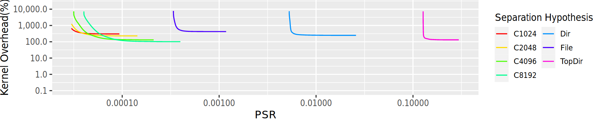

# μSCOPE Analysis Tutorial
This tutorial demos μSCOPE's core analysis features: automatically generating compartments and exploring privilege/performance tradeoffs.

To run this part of the tutorial, open a shell and navigate to the `analysis/`
directory. Make sure that you have Python2.7 installed as well as the NetworkX python package. You will also need some CAPMAP trace files, such as those provided in the ```RAID2021.tar.gz``` data file that accompanies the RAID submission (see Raw Data download link on the μSCOPE landing page). We recommend making a ```data``` subdirectory and unpacking the tar file into ```./data/RAID2021/```. CAPMAP files either have the ```.cmap``` extension or the ```.cmap.comp``` extension (if they are compressed; either works fine). CAPMAP trace files include raw instruction and object addresses, which means they are specific to a particular ```vmlinux``` image. The ```vmlinux``` image that matches these traces files is included in the tar file and can be found at ```./data/RAID2021/vmlinux```.

***1. Creating Compartments***

μSCOPE can automatically generate compartments that balance privilege reduction and performance. The file ```DomainCreator.py``` contains these algorithms. To run the demo, execute ```DomainCreator.py``` on a trace file. The first argument is the path to a ```vmlinux``` and the second argument is the path to a trace file (.cmap) that matches the ```vmlinux```.

For example, run the following:

```python DomainCreator.py ./data/RAID2021/vmlinux ./data/RAID2021/overhead/bullet.cmap.comp```

uSCOPE will then run a compartment generation algorithm using 4 different compartment size values. It may take a few minutes to complete.

**Inspecting Compartments**

When the command has finished, look inside the ```cluster_output``` directory to see the resulting compartments. For example, ```cluster_output/clusters_size_512``` contains compartments generated under the constraint that a single compartment may have no more than 512 bytes of code. The first few compartments are the following:
```
Compartment 1
        Contains these functions: (count=4,size=464 bytes)
                fs/ext4/ext4_jbd2.c:__ext4_journal_get_write_access (128 bytes)
                fs/ext4/inode.c:ext4_reserve_inode_write (160 bytes)
                fs/jbd2/transaction.c:jbd2_journal_get_write_access (112 bytes)
                fs/jbd2/transaction.c:jbd2_write_access_granted (64 bytes)
        Has privilege to access these objects: (5)
                THREAD_STACK STACK_PAGE
                ffffffff813d2350 KMEM_CACHE_fs/buffer.c:alloc_buffer_head
                ffffffff8148e80d KMEM_CACHE_fs/ext4/super.c:ext4_alloc_inode
                ffffffff814e07d5 KMEM_CACHE_fs/jbd2/transaction.c:jbd2__journal_start
                ffffffff814f29a3 KMEM_CACHE_fs/jbd2/journal.c:jbd2_journal_add_journal_head
Compartment 2
        Contains these functions: (count=6,size=503 bytes)
                drivers/acpi/acpica/exsystem.c:acpi_ex_system_wait_mutex (77 bytes)
                drivers/acpi/acpica/exutils.c:acpi_ex_enter_interpreter (84 bytes)
                drivers/acpi/acpica/utmutex.c:acpi_ut_acquire_mutex (127 bytes)
                drivers/acpi/osl.c:acpi_os_wait_semaphore (103 bytes)
                kernel/locking/semaphore.c:down_timeout (64 bytes)
                kernel/time/time.c:__msecs_to_jiffies (48 bytes)
        Has privilege to access these objects: (2)
                ffffffff81a1160a KMEM_CACHE_drivers/acpi/osl.c:acpi_os_create_semaphore
                ffffffff8dfe87a0 GLOBAL_acpi_gbl_mutex_info|B
```

Note that because the algorithms group together pieces of code that have high code and data affinity, compartments tend to group together related pieces of kernel functionality. 

***2. Exploring the Continuum***

The exciting thing about automated compartment generation is that it allows us to quickly explore the range of possible privilege/performance tradeoffs that can be made for a particular system. 

To see this exploration in action, run ```python sweep_edge_assignment.py ./data/RAID2021/vmlinux ./data/RAID2021/overhead/bullet.cmap.comp``` 

This tool will cause uSCOPE to create compartments and automatically report the range of privilege/performance design points over those compartments. This program will also take a few minutes to run. When it has finished, it will log the results in the ```edge_assignment_results/``` folder. 

**Visualing the Tradeoff Space**

Next, we will use R to plot the privilege/perfomance points. To plot the results, you will need to install R including the ```ggplot2```, ```reshape``` and ```scales``` packages. 

Run ```./plot_edge_assignment_curve.R```

The resulting figure will be written to ```output/edge_assignment_compare_cuts.pdf``` and should look like the following:



Each point in this figure corresponds to a single possible compartmentalization, where the Y axis shows the estimated overhead and the X axis shows the Privilege Set Ratio (PSR), an aggregate measurement of how much privilege has been reduced with that compartmentalization (see paper).

Congratulations! You've now used μSCOPE to automatically create compartments and explore the resulting tradeoff space.

**Next Steps and Notes**

To produce compartments with lower overheads and to explore more of compartmentalization space, try running the tools with larger domain sizes. 

In this demo, we used a single trace file. To produce more accurate overhead measurements, the complete set of benchmark traces should be used: see ```run_full_experiment.py``` for this methodology. This is the script that produces Fig. 6 in the paper. Running the full set of domains may take a long time; this script also has a batch mode that is allows it to run single domains in parallel.

Also note that this demo runs the ```CLUSTER_SIZE``` algorithm, which runs quickly and produces reasonable results. To learn more about the algorithm used in the uSCOPE paper (```CLUSTER_RATIO```), see Section 6 in the uSCOPE paper. The bottom of ```DomainCreator.py``` demonstrates how this algorithm can be run as well.
